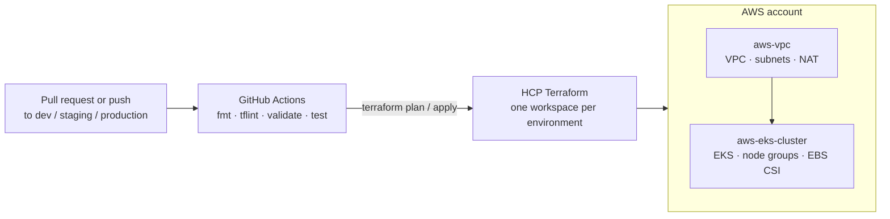

# hashi-platform

[](https://github.com/timkrebs/hashi-platform/actions/workflows/terraform-plan.yml)
[](https://github.com/timkrebs/hashi-platform/actions/workflows/terraform-apply.yml)
[](LICENSE)

An opinionated Kubernetes platform on AWS, built from reusable Terraform
modules and deployed through HCP Terraform. One repository holds the modules,
one root module per environment, and the GitHub Actions pipeline that plans on
pull requests and applies on merge.

## What you get

- **`aws-vpc`**: an EKS-ready VPC with private and public subnets per
  availability zone, NAT, and the subnet tags the AWS Load Balancer Controller
  needs.
- **`aws-eks-cluster`**: an EKS control plane with typed managed node groups
  (on-demand or spot, labels, taints), add-ons, and the EBS CSI driver wired up
  with IRSA.
- **Environments as roots**: `dev`, `staging` and `production` each compose
  the modules with their own sizing and CIDRs, backed by their own HCP
  Terraform workspace.
- **A pipeline you can trust**: format, lint, validate and unit tests on every
  pull request, a speculative plan posted on the PR, and an apply of exactly
  that saved plan behind GitHub environment approvals.
- **Guardrails as code**: Sentinel policies evaluated by HCP Terraform on
  every run require the platform tags on all resources and cap compute at
  `medium` instance sizes.

## How it fits together



## Repository layout

```text
.
├── .github/                 # workflows, issue and PR templates, CODEOWNERS
├── infra/
│   ├── modules/
│   │   ├── aws-vpc/         # network module (+ unit tests)
│   │   └── aws-eks-cluster/ # cluster module (+ unit tests)
│   ├── policies/            # Sentinel policy set for HCP Terraform (+ tests)
│   └── environments/
│       ├── dev/             # root module → workspace hashi-platform-dev
│       ├── staging/         # root module → workspace hashi-platform-staging
│       └── production/      # root module → workspace hashi-platform-production
├── .tflint.hcl              # shared lint rules
├── .pre-commit-config.yaml  # local checks mirroring CI
└── Makefile                 # fmt, lint, validate, test, plan
```

The [infra README](infra/README.md) documents the environment and branching
model, the CI/CD flow and its one-time setup, and how to add an environment.
Each module has its own README with inputs, outputs and examples:
[aws-vpc](infra/modules/aws-vpc/README.md),
[aws-eks-cluster](infra/modules/aws-eks-cluster/README.md).

## Getting started

Prerequisites: Terraform 1.15.x, [tflint](https://github.com/terraform-linters/tflint),
an HCP Terraform account with access to the `tim-krebs-org` organization, and
optionally [pre-commit](https://pre-commit.com).

```sh
git clone https://github.com/timkrebs/hashi-platform.git
cd hashi-platform
pre-commit install          # optional, runs the same checks as CI on commit
make check                  # fmt, tflint, validate, module unit tests
```

To plan an environment against its HCP Terraform workspace:

```sh
terraform login
make plan ENV=dev
```

The module unit tests run in plan mode against mocked providers, so `make test`
needs no AWS credentials.

## Branches and environments

| Branch       | Root module                     | HCP Terraform workspace     |
|--------------|---------------------------------|-----------------------------|
| `dev`        | `infra/environments/dev`        | `hashi-platform-dev`        |
| `staging`    | `infra/environments/staging`    | `hashi-platform-staging`    |
| `production` | `infra/environments/production` | `hashi-platform-production` |

Feature work goes into `dev` by pull request; promotion is a pull request from
`dev` to `staging` and from `staging` to `production`. Merging applies.

## Contributing

Contributions are welcome. Read [CONTRIBUTING.md](CONTRIBUTING.md) for the
workflow, coding standards and checklist, and the
[Code of Conduct](CODE_OF_CONDUCT.md) for community expectations. Security
issues go through the process in [SECURITY.md](SECURITY.md), not public issues.

## License

Copyright 2026 Tim Krebs. Licensed under the [Apache License 2.0](LICENSE).

The modules build on the community
[terraform-aws-modules](https://github.com/terraform-aws-modules) collection.
